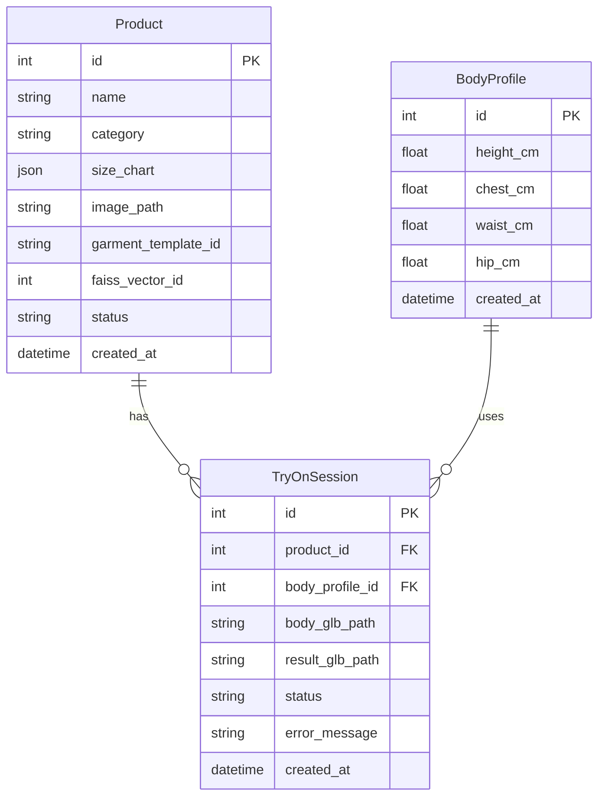
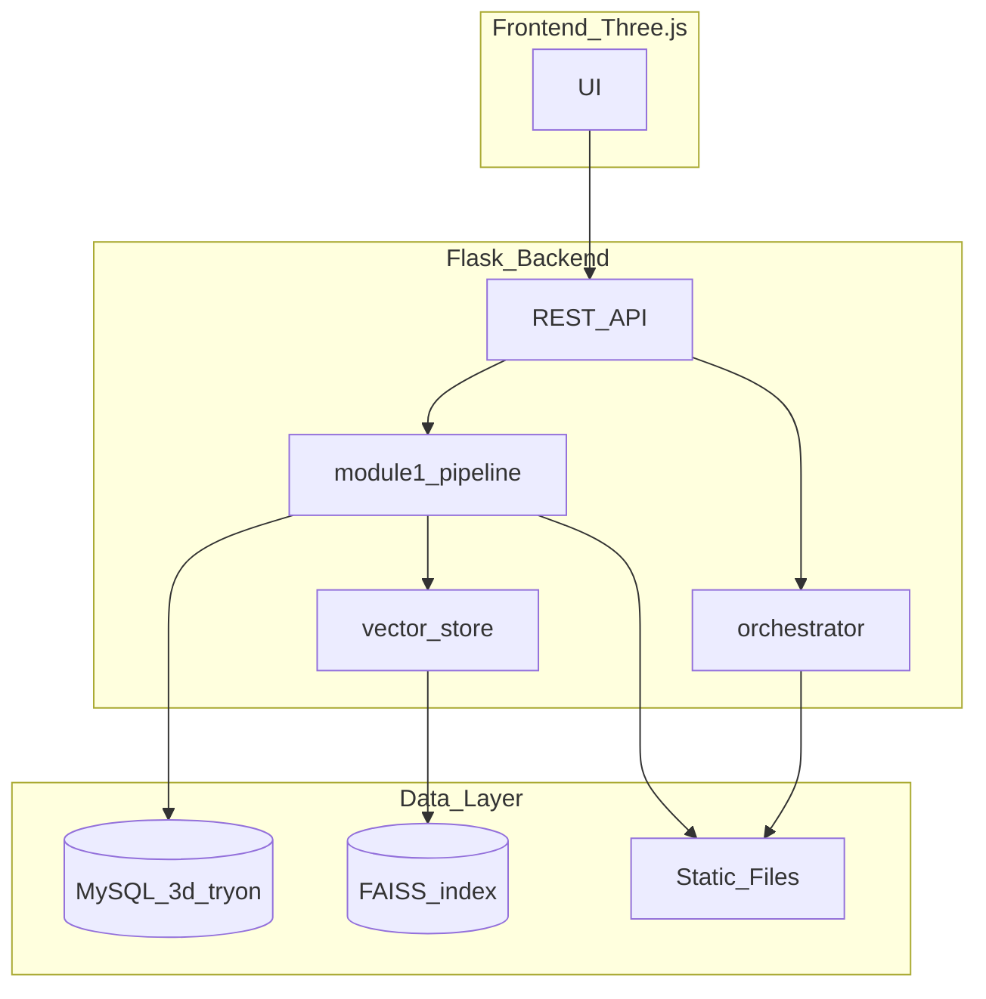

# 系統架構文件

## ER 圖



## 架構圖



## 效能策略（Phase 4）

1. 先量測 M2～M4 端到端耗時（`elapsed_seconds` 欄位）
2. **< 10 秒**：維持同步 `POST /api/tryon/simulate`
3. **> 30 秒**：引入 Celery + Redis，改用 `pending` + `GET /api/tryon/status/{id}` 輪詢

## 本地啟動

```bash
python -m venv .venv
.venv\Scripts\activate
pip install -r requirements.txt
copy .env.example .env
python -m database.init_db
flask --app app run
```

XAMPP MySQL 需先建立 `3d_tryon` 資料庫（utf8mb4）。
